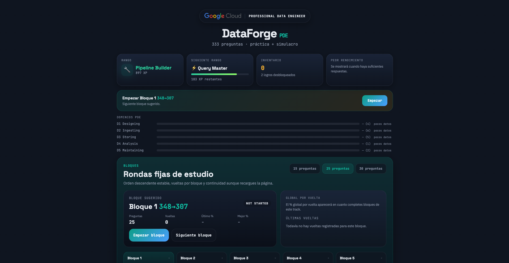
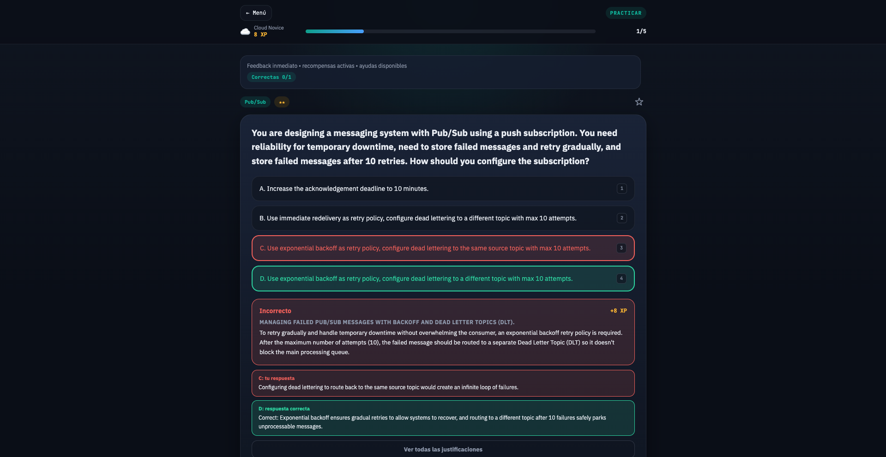
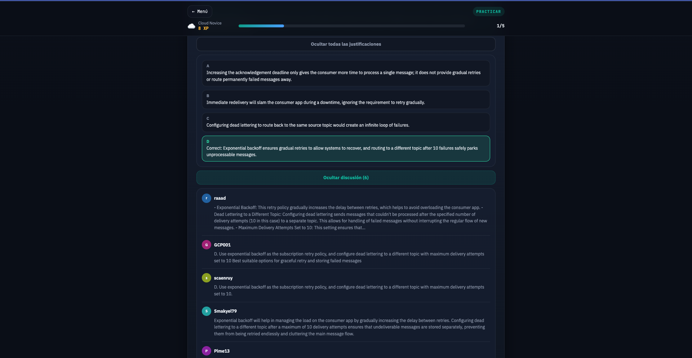
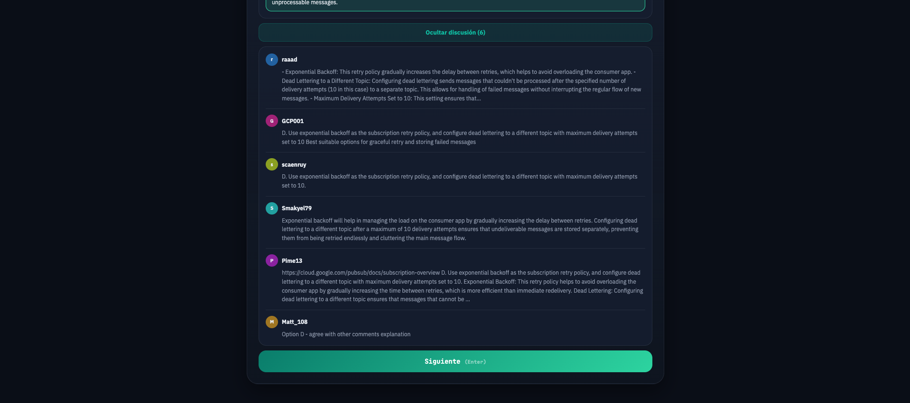
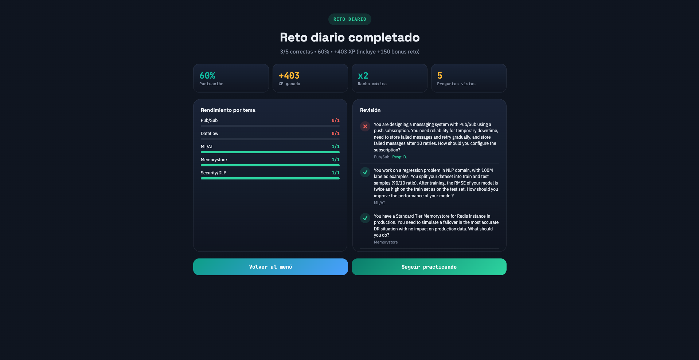

# Exam Prep

Local-first study app for IT certifications. Practice mode, timed mocks,
block-by-block study, daily challenge, and a small gamification layer
(XP, ranks, achievements, boss battles, mystery chests).

Originally built to prepare for the **Google Cloud Professional Data
Engineer (PDE)** exam. The codebase has been refactored into a
multi-cert architecture so other certifications can be plugged in
behind the same engine.

> Independent study tool, not affiliated with or sponsored by any
> certification authority. Brand names and logos are used solely as
> visual references.

## Status

- `gcp-pde` — complete (333 questions, 5 official domains, used for a
  successful exam attempt).
- `dbt-aeng` — planned, paused. See [STATUS.md](STATUS.md) for what is
  needed to bring it online.











<!-- TODO:  — pending: trigger a dragon battle and capture screenshot -->

## Stack

- React 18 + Vite
- No router, no state library, no CSS framework — `localStorage` for
  persistence
- Optional Docker deployment behind nginx

## Run locally

```bash
npm install
npm run dev          # http://localhost:5173
```

```bash
npm run build        # production bundle
npm run preview      # serve dist/
```

```bash
docker compose up    # http://localhost:8080
```

## Selecting a certification

The active cert is resolved at load time from the `cert` URL
parameter, falling back to `gcp-pde`:

```
http://localhost:5173/?cert=gcp-pde
```

There is no in-app selector yet — it will be added once a second cert
is registered.

## Architecture

```
src/
  App.jsx                 # main UI (single component, ~2.7k lines)
  main.jsx
  engine/                 # cert-agnostic logic
    quiz-engine.js          practice / mock / weak-topic / scoring
    block-study.js          block catalog and mastery
    session-manager.js      mock and block session lifecycle
    storage.js              createStorage(certId) factory, localStorage
    domain-helpers.js       createDomainHelpers({ topicMap, examDomains })
  data/
    gamification.js         XP curve, ranks, achievements, dragons, prizes
  components/rewards/     # SpinWheel, ScratchCard, MysteryChest, BossBattle, Confetti
  certs/
    index.js                # registry + getActiveCert(certIdFromUrl)
    gcp-pde/
      manifest.js             # cert contract (id, name, mock, domains, ...)
      domains.js              # TOPIC_MAP + EXAM_DOMAINS (data only)
      questions.js            # lazy-loaded chunk
      topics.js
      assets/logo.svg
  styles/
```

The engine never imports a specific cert. Cert data flows in through
the manifest registered in `src/certs/index.js`. Storage keys are
namespaced per cert id (e.g. `gcp-pde.progress.v2`).

## Adding a new certification

1. Create `src/certs/<cert-id>/` with:
   - `manifest.js` exporting an object with at least:
     `id`, `name`, `short`, `tagline`, `brand`, `logoPath`,
     `disclaimer`, `passPercent`, `mock: { count, durationSec }`,
     `topicMap`, `examDomains`, `loadQuestions: () => import("./questions.js")`.
   - `domains.js` exporting `TOPIC_MAP` and `EXAM_DOMAINS` (data only).
   - `questions.js` exporting `QUESTIONS` (array of items with the
     schema below).
   - `assets/logo.svg`.
2. Register the manifest in [src/certs/index.js](src/certs/index.js).
3. Open `http://localhost:5173/?cert=<cert-id>`.

`createDomainHelpers({ topicMap, examDomains })` and the engine
functions consume the manifest values at runtime — no other file
should need to change.

### Question schema

```js
{
  id: 1,
  topic: "Models",                  // raw label, mapped via TOPIC_MAP
  difficulty: 2,                    // 1 easy, 2 medium, 3 hard
  question: "...",
  options: ["A. ...", "B. ...", "C. ...", "D. ..."],
  correct: 1,                       // 0-based index, or array for multi-answer
  explanation: "...",
  discussion: [],                   // optional [{ user, text }]
  correctRationale: "...",          // optional, why the answer is right
  optionRationales: [],             // optional, one entry per option
  images: [{ url, alt }],           // optional, served from public/
  caseStudy: "ehr-healthcare",      // optional, key into manifest.caseStudies
  legacyNote: "...",                // optional, renders a warning banner
  resolvedBy: "gemini-2026-08",     // optional, who adjudicated a conflict
  sourceQuestionNumber: null,
  isRecent: false
}
```

## License

Personal project, no public license. Question banks are not committed
publicly outside of `gcp-pde` and were sourced from publicly available
practice material.
